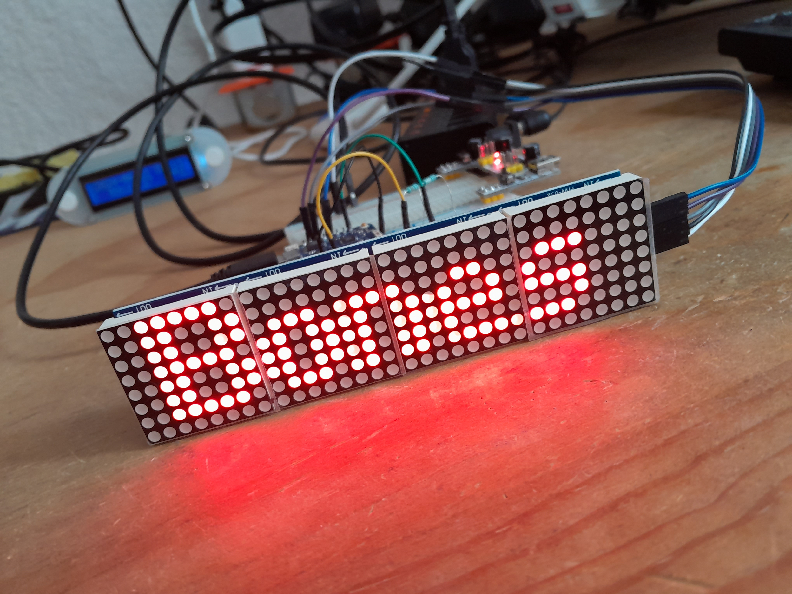
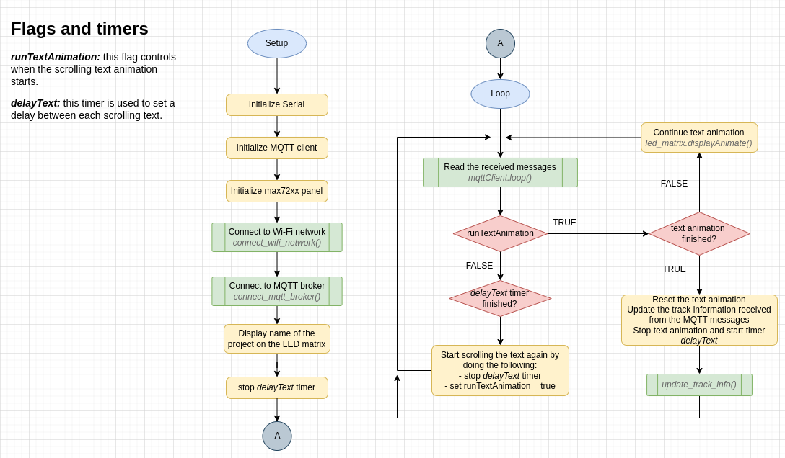

# LED matrix Spotify track info

This project displays the current track played on Spotify on a LED matrix.
The device gets the track information from the topics published by the program [spotify-mqtt-publisher](https://github.com/falb18/spotify-mqtt-publisher).
The led matrix displays the **title of the song**, the **name of the artist** and the **name of the album**.



The project uses the following Arduino libraries:
- [MD_Parola v3.7.3](https://github.com/MajicDesigns/MD_Parola)
- [MD_MAX72XX v3.5.1](https://github.com/MajicDesigns/MD_MAX72xx)
- [MQTT v2.5.2](https://github.com/256dpi/arduino-mqtt)
- [NoDelay v2.5.2](https://github.com/M-tech-Creations/NoDelay)

The following projects were useful to develop this project:
- [ESP8266_WiFiSmartConfig](https://github.com/usemodj/ESP8266_WiFiSmartConfig)

## Set network credentials

You need to install the [ESPTouch](https://github.com/EspressifApp/EsptouchForAndroid) app on your smarphone to connect
the device to a WiFi network.

After the initial connection, it remembers the network credentials. If reset, it will attempt to rejoin the same network
automatically for up to 10 times. If unsuccessful, it enters to smartconfig mode where you can provide new credentials.

If you encounter any Wi-Fi network issues, simply reset the device. As long as the network settings are correct, it will
automatically reconnect after the reset.

## Set MQTT broker

You will need an MQTT broker. You can set it up on your computer, or even on a small device like a Raspberry Pi.

In the Arduino code modify the broker's IP:
```arduino
IPAddress mqttBroker(xxx,xxx,xxx,xxx);
```

## Flowchart diagram of the program

This diagram illustrates the logic of the program:
